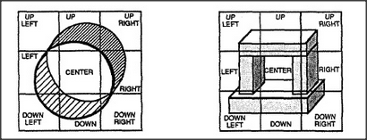

# Figure 24-3 — The nine direction-nemes around a scene

**File:** `ch24/24-3.png`
**Appears in:** [../../som-24.6.md](../../som-24.6.md) — *direction-nemes*

## What the image shows

Two square panels are drawn side by side. Each is divided into a 3×3 grid whose cells are labelled *UP LEFT*, *UP*, *UP RIGHT*, *LEFT*, *CENTER*, *RIGHT*, *DOWN LEFT*, *DOWN*, *DOWN RIGHT*. The left panel overlays the grid on a circular tube viewed end-on; the right panel overlays the same grid on a perspective view of a small block-built structure.

## What it illustrates

A scene is described by which of the nine direction-cells each of its parts occupies. The figure proposes that the brain attaches places and shapes to a small family of *direction-nemes* — one per cell — so that even an unfamiliar arrangement like the inside of a tube can be parsed in terms of *top*, *bottom*, and *sides*. The same nine-cell scheme returns in [24-4.md](24-4.md) for wall layout and in [24-5.md](24-5.md) as the terminals of a picture-frame.
