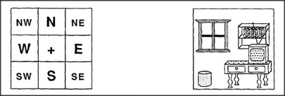

# Figure 24-4 — A wall described by compass-square zones

**File:** `ch24/24-4.png`
**Appears in:** [../../som-24.7.md](../../som-24.7.md) — *picture-frames*

## What the image shows

On the left, a 3×3 grid labelled with compass directions: *NW*, *N*, *NE* across the top; *W*, *+*, *E* in the middle; *SW*, *S*, *SE* across the bottom. On the right, a furnished wall is sketched — a window in the upper-left region, a set of shelves in the upper-right, a small barrel or stool toward the lower-left, and a table to the right.

## What it illustrates

A picture-frame for a wall does not need pixel-level detail; it needs nine direction-neme slots, each holding whatever was noticed in that zone. *Window at NW, shelves at NE, table at E* is enough to recognise later that something has been rearranged. The figure shows the simplest possible application of the direction-neme idea introduced in [24-3.md](24-3.md), and prepares the way for the picture-frame architecture of [24-5.md](24-5.md).
