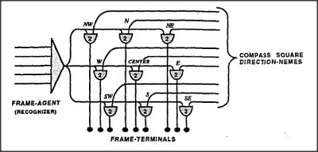

# Figure 24-5 — A picture-frame built from direction-nemes

**File:** `ch24/24-5.png`
**Appears in:** [../../som-24.8.md](../../som-24.8.md) — *how picture-frames work*

## What the image shows

On the left, a triangular agent labelled *FRAME-AGENT (RECOGNIZER)* feeds a horizontal trunk line. From that trunk, nine vertical lines descend into a row of AND-agent terminals labelled *FRAME-TERMINALS*. From the right, nine more lines labelled *COMPASS SQUARE DIRECTION-NEMES* enter the same terminals; each is tagged *NW*, *N*, *NE*, *W*, *CENTER*, *E*, *SW*, *S*, *SE*.

## What it illustrates

The picture-frame is the Trans-frame of [24-2.md](24-2.md) with one substitution: pronomes are replaced by direction-nemes. Each terminal fires only when both the frame is active and a given direction-neme is active, and the K-line attached to it stores whatever was seen when the eyes last looked that way. Recalling the scene by re-arousing the frame then plays each K-line back through its direction — producing the simulus of looking around inside the remembered place.
