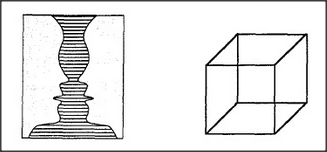

# Figure 25-1 — Candlestick/faces and Necker cube

**File:** `ch25/25-1.png`
**Appears in:** [../../som-25.1.md](../../som-25.1.md) — *one frame at a time?*

## What the image shows

Two classic ambiguous figures sit side by side. On the left, the Rubin vase — a hatched silhouette that reads either as a single ornate candlestick or as two profiles facing each other. On the right, a Necker cube — a simple wireframe cube whose orientation flips between being seen from above and from below.

## What it illustrates

The figure introduces the chapter's central observation: perception locks in one interpretation at a time. The same arrangement of edges admits two legitimate readings, but our agencies switch between them rather than holding both at once. This motivates the *locking-in* hypothesis — at each level of vision, every part is assigned to exactly one whole, which in turn is assigned to exactly one frame.
