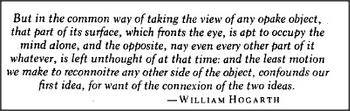

# Figure 25-14 — Epigraph from William Hogarth

**File:** `ch25/25-14.png`
**Appears in:** [../../som-25.5.md](../../som-25.5.md) — *expectations*

## What the image shows

A boxed epigraph rendered as scanned italic type. The text reads: *"But in the common way of taking the view of any opake object, that part of its surface, which fronts the eye, is apt to occupy the mind alone, and the opposite, nay even every other part of it whatever, is left unthought of at that time: and the least motion we make to reconnoitre any other side of the object, confounds our first idea, for want of the connexion of the two ideas." — WILLIAM HOGARTH*.

## What it illustrates

The epigraph opens the section on *expectations* by stating, in eighteenth-century prose, the very problem that frame-arrays are meant to solve: the front of an object monopolises attention, and the slightest motion erases what was just understood unless the viewer has learned to connect the two views. Hogarth's complaint that artists fail to *perfect the ideas they have in their minds about the objects in nature* anticipates the chapter's argument that imagining alternative viewpoints is a learned skill, supported by trained frame-arrays.
