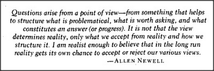

# Figure 25-15 — Epigraph from Allen Newell

**File:** `ch25/25-15.png`
**Appears in:** [../../som-25.6.md](../../som-25.6.md) — *the frame idea*

## What the image shows

A boxed epigraph rendered as scanned italic type. The text reads: *"Questions arise from a point of view — from something that helps to structure what is problematical, what is worth asking, and what constitutes an answer (or progress). It is not that the view determines reality, only what we accept from reality and how we structure it. I am realist enough to believe that in the long run reality gets its own chance to accept or reject our various views." — ALLEN NEWELL*.

## What it illustrates

The epigraph sits beside Minsky's retrospective on the 1974 frame essay. Newell's point — that a viewpoint shapes which questions are askable and which answers count as progress — matches the chapter's claim that the frame *idea* did its work less by being verifiable than by being at *the right level-band of detail* for the field at that time. Reality, in the end, accepts or rejects the view, but only after the view has organised enough of the work for the test to be meaningful.
