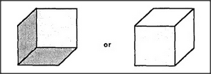

# Figure 25-2 — Two interpretations of a single cube

**File:** `ch25/25-2.png`
**Appears in:** [../../som-25.1.md](../../som-25.1.md) — *one frame at a time?*

## What the image shows

Two shaded cubes are drawn side by side with the word *or* between them. The cube on the left is shaded so its visible faces suggest the viewer is looking down at it from above; the cube on the right, shaded differently, suggests the viewer is looking up at it from below.

## What it illustrates

The figure follows on from [25-1.md](25-1.md) by showing that even when shading disambiguates a cube, two readings still coexist as alternatives — but never simultaneously. Frames compete to claim each feature, and only one frame wins at a time. The figure prepares the way for [25-3.md](25-3.md), where the question shifts from *which* frame to *how the same object is held together across many viewpoints*.
