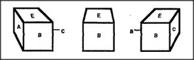

# Figure 25-3 — Three views of one cube

**File:** `ch25/25-3.png`
**Appears in:** [../../som-25.2.md](../../som-25.2.md) — *frame-arrays*

## What the image shows

Three drawings of the same cube appear in a horizontal row. The left view shows faces *A*, *B*, *E* with edge *C* receding to the right. The middle view shows only *E* on top and *B* in front. The right view shows *B*, *C*, *E* with edge *A* receding to the left.

## What it illustrates

A single object generates very different retinal images as the viewer moves around it. Face *A* is visible from the left view but gone from the right; face *C* is visible from the right but absent from the left. The figure makes vivid why moving would be terrifying if every step started vision from scratch — and motivates the frame-array of [25-4.md](25-4.md), which lets one inner model survive all three appearances.
