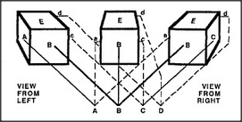

# Figure 25-4 — A frame-array sharing common terminals

**File:** `ch25/25-4.png`
**Appears in:** [../../som-25.2.md](../../som-25.2.md) — *frame-arrays*

## What the image shows

Three cube drawings — *VIEW FROM LEFT*, a centre view, and *VIEW FROM RIGHT* — sit across the top of the figure. Below them, a row of labelled terminals *A*, *B*, *C*, *D* runs across a horizontal band. Dashed lines fan from every visible face of every cube down into the same shared terminals, so that whichever view is currently active, its faces feed the same row of slots.

## What it illustrates

A frame-array is a family of frames that share one set of terminals. As the viewer moves and one frame is swapped for the next, the contents of the shared terminals persist — what was learned from the left view is still available when the right view takes over. This is the architectural trick that lets a single inner model survive many appearances and gives objects their apparent constancy.
