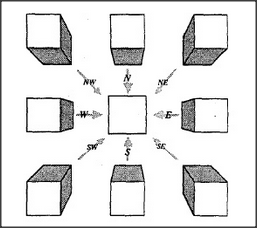

# Figure 25-5 — Compass-driven frame-array of a cube

**File:** `ch25/25-5.png`
**Appears in:** [../../som-25.3.md](../../som-25.3.md) — *the stationary world*

## What the image shows

A 3×3 grid of cube drawings. The central cell holds a head-on view; the eight surrounding cells hold the views obtained by moving north-west, north, north-east, west, east, south-west, south, or south-east of that centre. Small compass arrows labelled *NW*, *N*, *NE*, *W*, *E*, *SW*, *S*, *SE* connect each outer cell to the centre.

## What it illustrates

The same direction-nemes that move the viewer also select the next frame from the array. When the *east* direction-neme fires, the array switches the middle frame for the one to its left — exactly cancelling out the change in viewpoint, so the cube *appears* to stand still. The figure connects three earlier ideas: direction-nemes ([24-3.md](../ch24/24-3.md)), picture-frames ([24-5.md](../ch24/24-5.md)), and frame-arrays ([25-4.md](25-4.md)). The world looks stationary precisely *because* the inner model is being shuffled in lockstep with motion.
