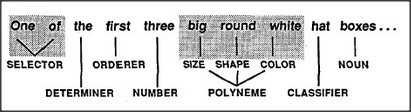

# Figure 26-12 — Adjective order in an English noun phrase

**File:** `ch26/26-12.png`
**Appears in:** [../../som-26.7.md](../../som-26.7.md) — *frames for nouns*

## What the image shows

A horizontal sentence-frame strip, with each cell holding a word from *One of the first three big round white hat boxes…* and a label below it. The labels read, left to right: *SELECTOR*, *DETERMINER*, *ORDERER*, *NUMBER*, *SIZE*, *SHAPE*, *COLOR*, *CLASSIFIER*, *NOUN*. The three central cells (*big*, *round*, *white*) are grouped under the bracketed label *POLYNEME*.

## What it illustrates

Noun phrases are read into a frame whose terminals expect a particular order. *Selector → determiner → orderer → number → size → shape → colour → classifier → noun* is not arbitrary punctuation; it is the slot schedule that English speakers tacitly agree on. Reorder the adjectives and the listener's frame stops accepting them — which is why *first three big brown heavy wooden boxes* reads naturally but *wooden three heavy brown big first boxes* does not. The three adjective slots together form a polyneme because they describe one object jointly.
