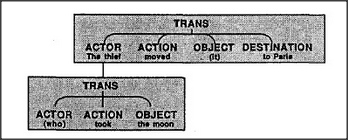

# Figure 26-13 — A Trans-frame nested inside a Trans-frame

**File:** `ch26/26-13.png`
**Appears in:** [../../som-26.8.md](../../som-26.8.md) — *frames for verbs*

## What the image shows

Two boxed Trans-frames are drawn one above the other. The upper, larger frame is headed *TRANS* and shows four terminals: *ACTOR — The thief*, *ACTION — moved*, *OBJECT — (it)*, *DESTINATION — to Paris*. The lower, smaller frame is also headed *TRANS* and shows *ACTOR — (who)*, *ACTION — took*, *OBJECT — the moon*. The lower frame sits beneath the Actor terminal of the upper, indicating it fills that slot.

## What it illustrates

The sentence *The thief who took the moon moved it to Paris* is parsed by stacking frames: the outer *move* Trans-frame's Actor is not a noun but another Trans-frame for *took*. The pronoun *who* signals that the listener should begin a second frame; the pronoun *it* points back at the moon already assigned in the inner frame. The figure shows how a small inventory of Trans-frames composes into arbitrarily long sentences without needing a new template per length — and previews [26-14.md](26-14.md), where the same nesting trick is shown for vision.
