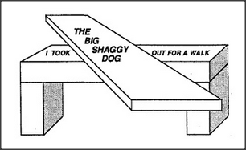

# Figure 26-14 — A sentence drawn as a tabletop

**File:** `ch26/26-14.png`
**Appears in:** [../../som-26.9.md](../../som-26.9.md) — *language and vision*

## What the image shows

A drawing of a long table top with two block-shaped legs. Inscribed across the table are three phrases laid out as one continuous label: *I TOOK* on the left leg, *THE BIG SHAGGY DOG* across the centre of the tabletop, and *OUT FOR A WALK* on the right leg.

## What it illustrates

The same compositional trick that lets language nest *who took the moon* inside *moved it to Paris* (see [26-13.md](26-13.md)) lets vision parse a tabletop and its two supports as one object even though the leg-tops are hidden. The verb phrase *took … out for a walk* is split by the noun phrase *the big shaggy dog* yet still understood as one unit; the visible table top is split by the obscured leg-tops yet still understood as one object. Vision and language appear to use the same machinery for binding separated parts into wholes.
