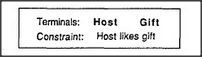

# Figure 26-2 — The present subframe

**File:** `ch26/26-2.png`
**Appears in:** [../../som-26.2.md](../../som-26.2.md) — *understanding stories*

## What the image shows

A small two-row table. The first row reads *Terminals:* and lists two slots, *Host* and *Gift*. The second row reads *Constraint:* and lists the single rule *Host likes gift*.

## What it illustrates

The figure shows the minimum machinery a reader needs to make sense of *Mary was invited to Jack's party. She wondered if he would like a kite.* A *present* subframe has just two terminals — who the gift is for and what the gift is — together with one default constraint that ties them together. The constraint is what lets the reader conclude that the kite is for Jack without any sentence ever saying so. The merge with [26-3.md](26-3.md) shows the constraint in action.
