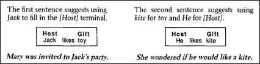

# Figure 26-3 — Two sentences filling the present frame

**File:** `ch26/26-3.png`
**Appears in:** [../../som-26.2.md](../../som-26.2.md) — *understanding stories*

## What the image shows

Two side-by-side boxes show successive states of the same *present* subframe. On the left, the caption reads *The first sentence suggests using Jack to fill in the [Host] terminal*; the slots show *Host = Jack*, *Gift = ____*, with the constraint *likes* between them. Beneath the box: *Mary was invited to Jack's party.* On the right, the caption reads *The second sentence suggests using kite for toy and He for [Host]*; the slots now read *Host = He*, *Gift = kite*. Beneath the box: *She wondered if he would like a kite.*

## What it illustrates

The figure shows the merge step that completes story comprehension. Sentence one fills *Host*; sentence two fills *Gift* and re-references the host through the pronoun *He*. Because the *Host likes Gift* constraint introduced in [26-2.md](26-2.md) is preserved, the reader infers — without any sentence stating it — that the kite is the present, and that it is for Jack. Frames carry the inference that the words leave out.
