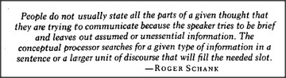

# Figure 26-5 — Epigraph from Roger Schank

**File:** `ch26/26-5.png`
**Appears in:** [../../som-26.3.md](../../som-26.3.md) — *sentence-frames*

## What the image shows

A boxed epigraph rendered as scanned italic type. The text reads: *"People do not usually state all the parts of a given thought that they are trying to communicate because the speaker tries to be brief and leaves out assumed or unessential information. The conceptual processor searches for a given type of information in a sentence or a larger unit of discourse that will fill the needed slot." — ROGER SCHANK*.

## What it illustrates

Schank's remark sits at the head of the *sentence-frames* section because it states the operating principle directly: speakers omit the predictable, and listeners run a process that hunts through sentence and discourse for whatever will fill a slot left open by a frame. The chapter's reworking of Schank's *conceptual processor* into Trans-frames and sentence-frames is the rest of the answer to *how* that search is structured.
