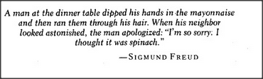

# Figure 27-1 — Epigraph from Sigmund Freud

**File:** `ch27/27-1.png`
**Appears in:** [../../som-27.1.md](../../som-27.1.md) — *demons* (chapter opener)

## What the image shows

A boxed epigraph rendered as scanned italic type. The text reads: *"A man at the dinner table dipped his hands in the mayonnaise and then ran them through his hair. When his neighbor looked astonished, the man apologized: 'I'm so sorry. I thought it was spinach.'" — SIGMUND FREUD*.

## What it illustrates

The epigraph opens the chapter on *Censors and Jokes*. Freud's anecdote is funny precisely because the apology preserves the wrong rule — *spinach belongs in hair* — while admitting a slip about which condiment was on hand. A censor that should have intercepted the act before it began did not fire, and a second, lower-quality rule fired instead. The chapter develops that mechanism: suppressors that catch a bad thought after it occurs, and censors that catch the state of mind that usually precedes it.
