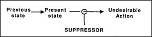

# Figure 27-2 — Suppressor on the path to an undesired action

**File:** `ch27/27-2.png`
**Appears in:** [../../som-27.2.md](../../som-27.2.md) — *suppressors*

## What the image shows

A small inline diagram. From left to right: a box labelled *Previous state*, an arrow to a box labelled *Present state*, an arrow continuing to a small circle, and then an arrow to a box labelled *Undesirable Action*. A separate arrow rises from a box labelled *SUPPRESSOR* into the small circle, cutting the path.

## What it illustrates

A suppressor is an agent that has learned to recognise the *present state* that, last time, led straight to a mistake. When that state occurs again, the suppressor intercepts the link to the action — in effect saying *Stop thinking that!* The figure shows the cost of this design: the bad thought still has to happen before it can be caught, so the next section introduces censors that act earlier, on the previous state, before the bad thought forms at all.
