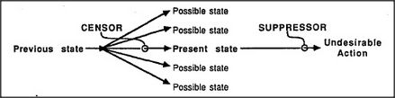

# Figure 27-3 — Censor and suppressor in the stream of states

**File:** `ch27/27-3.png`
**Appears in:** [../../som-27.3.md](../../som-27.3.md) — *censors*

## What the image shows

A horizontal flow runs left to right inside a framed panel. *Previous state* on the left fans out through five branches into a column of possible next states — *Possible state*, *Possible state*, *Present state*, *Possible state*, *Possible state*. The fan-out point is labelled *CENSOR*. A single arrow then continues from *Present state* to *Undesirable Action* on the right; a small inhibitory marker on that arrow is labelled *SUPPRESSOR*.

## What it illustrates

The figure shows the two intercepting agents working at different moments. A *suppressor* sits at the very end of the chain and blocks an action just as it is about to occur — costly in time, because nothing happens until an alternative is found. A *censor* sits one step earlier, at the branch point, and deflects the trajectory toward an acceptable next state before the bad action is even reached. The earlier the cut, the cheaper the avoidance — but the more states the censor must learn to recognise.
