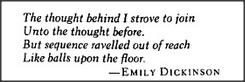

# Figure 27-4 — Epigraph from Emily Dickinson

**File:** `ch27/27-4.png`
**Appears in:** [../../som-27.4.md](../../som-27.4.md) — *exceptions to logic*

## What the image shows

A boxed epigraph in italic type:

> *The thought behind I strove to join*
> *Unto the thought before,*
> *But sequence ravelled out of reach*
> *Like balls upon the floor.*
> — EMILY DICKINSON

## What it illustrates

Dickinson's quatrain stands at the head of the section on exceptions to logic. Her image of a sequence "ravelled out of reach" mirrors the chapter's argument: chains of reasoning unravel because the facts they rest on rarely hold without exception. The section that follows develops the practical response — keep working inside *islands of consistency* and mark their unsafe boundaries, rather than chasing a logic that no real-world statement can sustain.
