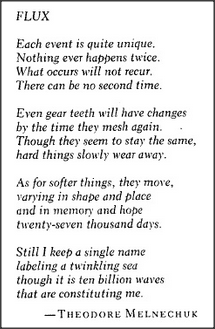

# Figure 28-1 — Epigraph "Flux" by Theodore Melnechuk

**File:** `ch28/28-1.png`
**Appears in:** [../../som-28.1.md](../../som-28.1.md) — *the myth of mental energy* (chapter opener)

## What the image shows

A boxed epigraph titled *FLUX*, attributed to Theodore Melnechuk. The poem reads:

> *Each event is quite unique.*
> *Nothing ever happens twice.*
> *What occurs will not recur.*
> *There can be no second time.*
>
> *Even gear teeth will have changes*
> *by the time they mesh again.*
> *Though they seem to stay the same,*
> *hard things slowly wear away.*
>
> *As for softer things, they move,*
> *varying in shape and place*
> *and in memory and hope*
> *twenty-seven thousand days.*
>
> *Still I keep a single name*
> *labeling a twinkling sea*
> *though it is ten billion waves*
> *that are constituting me.*

## What it illustrates

The epigraph opens chapter 28 on the mind's relation to the world. Melnechuk's image — one stable name riding atop ten billion waves — names the chapter's central problem: how a coherent self appears to persist while every underlying part is in flux. The chapter answers in mechanism, arguing that quantities such as *mental energy* are illusions that arise because mental agencies need stable currencies to regulate transactions among themselves, much as communities settle on money.
