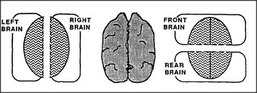

# Figure 28-3 — Left, right, front, and rear brains

**File:** `ch28/28-3.png`
**Appears in:** [../../som-28.8.md](../../som-28.8.md) — *overlapping minds*

## What the image shows

Three panels sit inside a single frame. The leftmost panel labels the two hemispheres *LEFT BRAIN* and *RIGHT BRAIN* as separate hatched ovals. The middle panel shows a top-down anatomical sketch of a whole brain with its central fissure visible. The rightmost panel re-cuts the same brain front-to-back, labelling the parts *FRONT BRAIN* and *REAR BRAIN*.

## What it illustrates

If the popular *left-brain / right-brain* split entitles each hemisphere to its own mind, the figure asks why the equally arbitrary front/rear split should not also yield two minds. The point is not anatomical but methodological: a region of brain only counts as a *mind* in its own right when the relationships among its parts show some genuine coherency. The chapter uses this to argue for a society of overlapping mini-minds — agencies that share agents and walls without sharing one another's mental lives.
