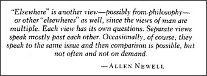

# Figure 29-1 — Epigraph from Allen Newell

**File:** `ch29/29-1.png`
**Appears in:** [../../som-29.1.md](../../som-29.1.md) — *the realms of thought* (chapter opener)

## What the image shows

A boxed epigraph in italic type:

> *"Elsewhere" is another view — possibly from philosophy — or other "elsewheres" as well, since the views of man are multiple. Each view has its own questions. Separate views speak mostly past each other. Occasionally, of course, they speak to the same issue and then comparison is possible, but not often and not on demand.* — ALLEN NEWELL

## What it illustrates

Newell's remark opens the chapter on realms of thought. Different ways of looking at the mind — physiology, psychology, philosophy, computation — pose their own questions and rarely translate cleanly into one another. The chapter takes this as a working condition rather than a deficiency: a useful theory of mind must let many realms coexist and connect through intermediate levels (walls between bricks and houses) rather than insist on a single unified frame.
