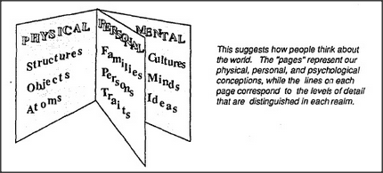

# Figure 29-2 — Pages of an encyclopedia of everything

**File:** `ch29/29-2.png`
**Appears in:** [../../som-29.1.md](../../som-29.1.md) — *the realms of thought*

## What the image shows

An open accordion-style book is drawn with three labelled pages — *PHYSICAL*, *PERSONAL*, *MENTAL*. Each page lists topics at decreasing scale: *Structures / Objects / Atoms* on the physical page; *Families / Persons / Traits* on the personal page; *Cultures / Minds / Ideas* on the mental page. A caption beside the book reads: *This suggests how people think about the world. The "pages" represent our physical, personal, and psychological conceptions, while the lines on each page correspond to the levels of detail that are distinguished in each realm.*

## What it illustrates

The figure renders the chapter's central image of knowledge organised as separate but adjacent realms. Within a page, levels of detail differ by small steps that intermediate concepts can bridge (bricks → walls → houses). Between pages, the gap is far larger — minds and bricks lie volumes apart in any well-arranged encyclopedia. Comprehension within a realm is the easy case; crossing between realms is what most of the chapter's later mechanisms are for.
