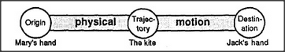

# Figure 29-3 — *Give* in the physical realm

**File:** `ch29/29-3.png`
**Appears in:** [../../som-29.2.md](../../som-29.2.md) — *several thoughts at once*

## What the image shows

A horizontal Trans-frame strip with three labelled nodes. *Origin* on the left is annotated *Mary's hand*; *Trajectory* in the middle is annotated *The kite*; *Destination* on the right is annotated *Jack's hand*. The connecting bars are labelled *physical* and *motion*.

## What it illustrates

This is the spatial reading of *Mary gives Jack the kite*: an object moves along a trajectory from one place to another. The figure isolates one of the three simultaneous interpretations the section identifies, and it sets up the parallel structure that [29-4.md](29-4.md) and [29-5.md](29-5.md) will repeat — the same Trans-frame shape, the same Origin/Trajectory/Destination slots, but operating in a different realm.
