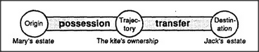

# Figure 29-4 — *Give* in the realm of estates

**File:** `ch29/29-4.png`
**Appears in:** [../../som-29.2.md](../../som-29.2.md) — *several thoughts at once*

## What the image shows

The same Trans-frame strip as [29-3.md](29-3.md). *Origin* is annotated *Mary's estate*; *Trajectory* is annotated *The kite's ownership*; *Destination* is annotated *Jack's estate*. The connecting bars now read *possession* and *transfer*.

## What it illustrates

In the *realm of estates*, *give* requires no physical motion at all — what moves is ownership. The figure makes the parallel with [29-3.md](29-3.md) explicit and introduces the chapter's claim that this realm sits between the realms of objects and of ideas: plans depend on taking possession of materials, tools, or concepts by right or by might before anything can be done with them.
