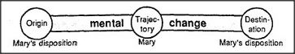

# Figure 29-5 — *Give* in the social or psychological realm

**File:** `ch29/29-5.png`
**Appears in:** [../../som-29.2.md](../../som-29.2.md) — *several thoughts at once*

## What the image shows

Again the same Trans-frame strip. *Origin* is annotated *Mary's disposition*; *Trajectory* is annotated *Mary*; *Destination* is annotated *Mary's disposition* (the change is internal to Mary). The bars read *mental* and *change*.

## What it illustrates

The third simultaneous reading: giving is also a social act that shifts the giver's affections and obligations. Together with [29-3.md](29-3.md) and [29-4.md](29-4.md) the figure shows one phrase parsed three times in parallel, in three realms that do not compete for the same agents — which is why the meanings can run side by side without interfering, just as colour and shape can both describe an apple at once.
