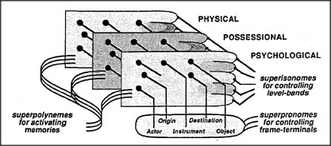

# Figure 29-6 — Paranomes across stacked realms

**File:** `ch29/29-6.png`
**Appears in:** [../../som-29.3.md](../../som-29.3.md) — *paranomes*

## What the image shows

Three rectangular grids are stacked into a shallow cuboid, labelled (top to bottom) *PHYSICAL*, *POSSESSIONAL*, *PSYCHOLOGICAL*. Each grid has the same column layout — *Actor*, *Instrument*, *Object* — with *Origin* and *Destination* marked along one edge. From the left of the stack, looped wires labelled *superpolynemes for activating memories* run inward. From the right, two more bundles emerge: *superonomes for controlling level-bands* and *superpronomes for controlling frame-terminals*.

## What it illustrates

The figure is the chapter's central architecture diagram. The three Trans-frames of [29-3.md](29-3.md), [29-4.md](29-4.md), and [29-5.md](29-5.md) are restacked as parallel sheets sharing the same slot structure. *Paranomes* are pronomes that operate across the stack at once — one Origin signal addresses Mary's hand, Mary's estate, and Mary's disposition simultaneously. The looped bundles on either side show how superpolynemes activate memories and how superpronomes blink slots across realms in unison, letting each realm think on its own while the language-agency keeps them in step.
