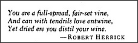

# Figure 29-8 — Epigraph from Robert Herrick

**File:** `ch29/29-8.png`
**Appears in:** [../../som-29.7.md](../../som-29.7.md) — *likenesses and analogies*

## What the image shows

A boxed epigraph in italic type:

> *You are a full-spread, fair-set vine,*
> *And can with tendrils love entwine,*
> *Yet dried ere you distill your wine.*
> — ROBERT HERRICK

## What it illustrates

Herrick's verse is the section's worked example of a metaphor that fails when read too literally. The poet compares a woman to a vine — but by anchoring the image so tightly to vegetable shape and tendril, he draws the reader's mental machinery toward the wrong realm and produces, the section argues, *fantasies of vegetables with hands and feet*. The point is mechanical, not aesthetic: an analogy succeeds when it lets the listener switch realms easily, and fails when the surface description holds the listener inside the source realm.
