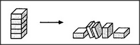

# Figure 3-1 — PLAY, with BUILDER and WRECKER as rivals

**File:** `ch3/3-1.png`
**Appears in:** [../../som-3.1.md](../../som-3.1.md) — *Conflict*

## What the image shows

A three-tier diagram. The top row holds three high-level agencies —
**EAT**, **PLAY**, and **SLEEP** — drawn with double-headed arrows
between them to mark that they compete for the body. PLAY branches
downward to three children: **PLAY-WITH-DOLLS**, **PLAY-WITH-BLOCKS**,
and **PLAY-WITH-ANIMALS**. **PLAY-WITH-BLOCKS** in turn branches to
two rivals — **BUILDER** (with sub-workers **BEGIN**, **ADD**, **END**)
and **WRECKER** (with sub-worker **PUSHER**).

## What it illustrates

Conflict at every level of the society. Eating, playing, and sleeping
compete for control of the child; within play, three pastimes compete;
within blocks, building and wrecking compete. The figure sets up the
chapter's question: when two agencies want incompatible things, what
mechanism decides which one wins?
