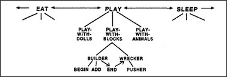

# Figure 3-2 — Tower and ruins

**File:** `ch3/3-2.png`
**Appears in:** [../../som-3.1.md](../../som-3.1.md) — *Conflict*

## What the image shows

Two small drawings separated by an arrow. On the left, a neat vertical
stack of blocks — a finished tower. On the right, after the arrow,
the same blocks lie scattered on the ground in a heap.

## What it illustrates

The reward asymmetry that makes BUILDER and WRECKER permanent rivals.
Building takes patient, ordered work; wrecking is a single satisfying
swat. The picture is Minsky's reminder that any society that contains
construction will also contain agents who prefer destruction, and that
the two will keep competing for the same hands.
