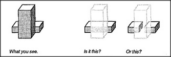

# Figure 3-3 — Ambiguous cube

**File:** `ch3/3-3.png`
**Appears in:** [../../som-3.4.md](../../som-3.4.md) — *Heterarchies*

## What the image shows

Three small block drawings in a row. The leftmost shows a roughly
cube-shaped form, captioned *What you see*. The middle and right
panels show two different three-dimensional interpretations of the
same outline — one with a smaller cube *attached* to the front-right
face, captioned *Is it this?*, and one with a smaller cube *removed*
from that same corner, captioned *Or this?*

## What it illustrates

The same retinal image supports two equally good three-dimensional
readings, and the visual system must commit to one. Minsky uses the
example to argue against strict top-down hierarchies: deciding which
reading wins requires agencies at many levels to talk sideways to one
another, not just up and down. The figure is the chapter's pretext for
*heterarchy*.
