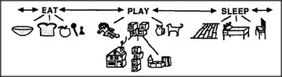

# Figure 3-4 — EAT, PLAY, SLEEP as icon rows

**File:** `ch3/3-4.png`
**Appears in:** [../../som-3.5.md](../../som-3.5.md) — *Destructiveness*

## What the image shows

The same three top-level agencies as Figure 3-1 — **EAT**, **PLAY**,
**SLEEP** — joined by double-headed arrows, but here each is rendered
as a row of small pictograms instead of a name. EAT shows a bowl,
loaf, sandwich, glass and bottle; PLAY shows a doll, dog, blocks,
toy car, and a house being built and knocked over; SLEEP shows a
pillow, bed, and chair.

## What it illustrates

A visual restatement of the high-level competition introduced in
Figure 3-1, now in the vocabulary the child actually uses. The
pictograms make the point that each top-level agency is itself a
small market of concrete options, and that the conflict between EAT,
PLAY, and SLEEP is also a conflict between hundreds of specific
desires below them.
