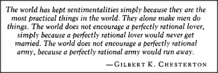

# Figure 30-1 — Epigraph from G. K. Chesterton

**File:** `ch30/30-1.png`
**Appears in:** [../../som-30.3.md](../../som-30.3.md) — *mental models*

## What the image shows

A boxed epigraph in italic type:

> *The world has kept sentimentalities simply because they are the most practical things in the world. They alone make men do things. The world does not encourage a perfectly rational lover, simply because a perfectly rational lover would never get married. The world does not encourage a perfectly rational army, because a perfectly rational army would run away.* — GILBERT K. CHESTERTON

## What it illustrates

Chesterton's remark closes the section on mental models. A mental model is whatever a person's other agencies can use to answer questions — not a literal copy of the thing modelled, and not a faultless one. Models of oneself are *self-made answering machines*; they predict by sentiment as much as by reason, and they are practical for exactly that reason. The quote justifies the chapter's stance that imperfect models, including sentimental ones, are the working substrate of mind.
