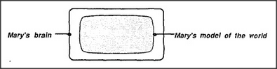

# Figure 30-2 — Mary's brain holds Mary's model of the world

**File:** `ch30/30-2.png`
**Appears in:** [../../som-30.4.md](../../som-30.4.md) — *world models*

## What the image shows

A framed panel contains a small oval labelled *Mary's brain* on the left. An arrow points inward to a larger rounded shape that fills most of the frame and is labelled *Mary's model of the world*. The model sits entirely inside the surrounding frame.

## What it illustrates

The figure introduces *world model* as a defined term: the collection of structures inside Mary's head that her agencies can use to answer questions about things in the world. The diagram makes one geometric point — the model lives inside the brain — and one conceptual one: the model has parts that answer questions about particular things, but it has no part that answers the question *What is the world itself?*. That predicament motivates the construction in [30-3.md](30-3.md).
