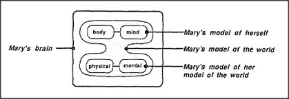

# Figure 30-3 — Models of models nested inside Mary's brain

**File:** `ch30/30-3.png`
**Appears in:** [../../som-30.4.md](../../som-30.4.md) — *world models*

## What the image shows

A larger panel labelled *Mary's brain* contains two rounded sub-regions stacked vertically. The upper sub-region holds two small ovals — *body* and *mind* — and is labelled *Mary's model of herself*. The lower sub-region holds two small ovals — *physical* and *mental* — and is labelled *Mary's model of her model of the world*. A third arrow on the right points to the whole panel and is labelled *Mary's model of the world*.

## What it illustrates

The figure extends [30-2.md](30-2.md) by drawing the next level of nesting. Inside the world model sits a model of Mary herself (body and mind) and a model of her own world model (physical and mental). The diagram makes the chapter's central move visible: because Mary cannot examine the world or herself directly, what she can examine are her models — and what she can know about those is her models of her models. The dumbbell layout (two clusters with little between them) anticipates the body/mind diagram in [30-4.md](30-4.md).
