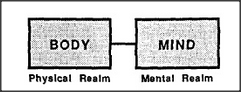

# Figure 30-4 — Body and mind as two realms

**File:** `ch30/30-4.png`
**Appears in:** [../../som-30.5.md](../../som-30.5.md) — *knowing ourselves*

## What the image shows

A small framed panel contains two solid boxes side by side, joined by a short connecting bar. The left box is labelled *BODY* and captioned *Physical Realm*; the right box is labelled *MIND* and captioned *Mental Realm*.

## What it illustrates

When Mary tries to describe herself, her answers cluster into two loosely connected domains with little in between — the dumbbell that the section calls her *model of her model of herself*. The figure draws that dumbbell at its most stripped-down: the physical realm and the mental realm, joined by a single thin link. The diagram does not claim that body and mind *are* two things; it shows the structural shape that Mary's self-reports take when she tries to summarise an entity she has no direct way to examine.
