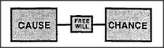

# Figure 30-5 — Cause, Free Will, Chance

**File:** `ch30/30-5.png`
**Appears in:** [../../som-30.7.md](../../som-30.7.md) — *the myth of the third alternative*

## What the image shows

A framed panel holds three boxes in a row, joined by short connecting bars. A large left-hand box is labelled *CAUSE*. A large right-hand box is labelled *CHANCE*. Between them sits a much smaller central box labelled *FREE WILL*.

## What it illustrates

To rescue voluntary choice from determinism and randomness, common sense postulates a third alternative — a Will that is neither caused nor accidental — and locates it between *CAUSE* and *CHANCE*. The figure draws that third box deliberately small. Whenever something turns out to follow a law it migrates leftward into *CAUSE*; whenever something turns out to be unpatterned it migrates rightward into *CHANCE*; the central box is steadily emptied. The chapter argues that Free Will is psychologically necessary even so — responsibility, praise, and blame depend on it — and must be maintained even as its mechanical room shrinks.
