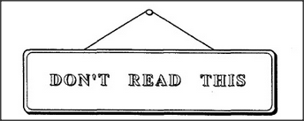

# Figure 5-2 — *DON'T READ THIS*

**File:** `ch5/5-2.png`
**Appears in:** [../../som-5.7.md](../../som-5.7.md) — *Permanent identity*

## What the image shows

A small framed sign, drawn as if hanging on a wall by a string. The
sign's only content is the message **DON'T READ THIS** in stencilled
capitals.

## What it illustrates

The self-undermining instruction Minsky uses as a one-line proof that
a mind cannot be a single thing. By the time you have read enough of
the sign to obey it, you have already disobeyed it. The figure makes
the chapter's point visually: there must be at least two agents
inside — the reader and the asker — for the joke to land at all.
