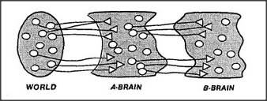

# Figure 6-1 — World, A-Brain, B-Brain

**File:** `ch6/6-1.png`
**Appears in:** [../../som-6.4.md](../../som-6.4.md) — *B-Brains*

## What the image shows

Three rounded blobs in a row, drawn like cross-sections of cells, each
filled with small dots representing agents. The leftmost blob is
labelled **WORLD**, the middle one **A-BRAIN**, and the rightmost
**B-BRAIN**. A dense bundle of arrows runs from WORLD into A-BRAIN,
and a second bundle runs from A-BRAIN into B-BRAIN. Return arrows
travel the other way: B-BRAIN → A-BRAIN → WORLD. The arrows are
unlabelled.

## What it illustrates

The chapter's central architecture. The A-brain talks to the world;
the B-brain talks only to the A-brain. Because the B-brain never
sees the world directly, it can only know the A-brain's *patterns* —
which is exactly what is needed for it to act as a supervisor that
notices when the A-brain is stuck in a loop, daydreaming, or about
to take a destructive path. The figure makes recursive self-monitoring
look simple by showing it as one more layer of the same wiring.
