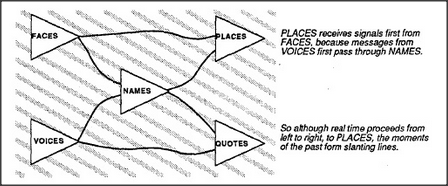

# Figure 6-2 — Slanting lines of memory

**File:** `ch6/6-2.png`
**Appears in:** [../../som-6.6.md](../../som-6.6.md) — *Momentary mental time*

## What the image shows

Four triangular nodes arranged in two columns on a faintly hatched
background. The left column holds **FACES** and **VOICES**; the right
column holds **PLACES**, **NAMES**, and **QUOTES**. Curved arrows
sweep diagonally between them: FACES → PLACES, VOICES → NAMES, NAMES
→ QUOTES, and a back-loop from NAMES toward PLACES. Two captions on
the right read:

- "PLACES receives signals first from FACES, because messages from
  VOICES first pass through NAMES."
- "So although real time proceeds from left to right, to PLACES, the
  moments of the past form slanting lines."

## What it illustrates

The slip between physical time and mental time. Different signals
take different numbers of hops to reach a given destination, so the
"now" that any one agency sees is a slanted slice through several
different *thens*. The figure is Minsky's argument that the
experienced present is a construction made of stale messages from
several pasts.
