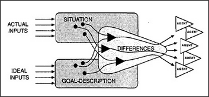

# Figure 7-1 — A difference-engine

**File:** `ch7/7-1.png`
**Appears in:** [../../som-7.8.md](../../som-7.8.md) — *Difference-engines*

## What the image shows

A flow diagram. On the left, two input streams labelled **ACTUAL
INPUTS** and **IDEAL INPUTS** feed into two boxes stacked vertically:
**SITUATION** (top) and **GOAL-DESCRIPTION** (bottom). Both boxes
send arrows into a central lens-shaped node labelled **DIFFERENCES**.
From DIFFERENCES, a fan of arrows runs out to the right toward a
column of small triangles labelled **AGENT**, **AGENT**, **AGENT**,
**AGENT**, each receiving one of the difference signals.

## What it illustrates

Newell and Simon's difference-reduction machine, redrawn as a society
fragment. The engine compares the situation to the goal, computes a
difference, and uses that difference to select which lower-level
agent fires next. The figure is Minsky's bridge from the classical
problem-solver of *GPS* to his account of how a society can pursue a
goal without anyone in it knowing what a goal is.
