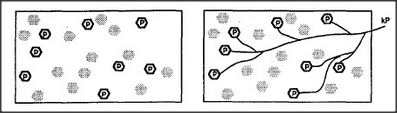

# Figure 8-1 — A K-line attached to active agents

**File:** `ch8/8-1.png`
**Appears in:** [../../som-8.2.md](../../som-8.2.md) — *Re-membering*

## What the image shows

Two side-by-side rectangular panels representing the same population
of agents, drawn as small lettered circles scattered across the
field. In the left panel, a sprinkling of agents are darkened to
show that they were active while problem P was being solved. In the
right panel, a new agent labelled **kP** has appeared off to one
side, with a fan of lines reaching out and touching every one of the
agents that had been active.

## What it illustrates

The basic K-line construction. A K-line is built by attaching a new
agent to whichever agents happened to be active during some episode,
so that later re-activating the K-line will rouse the same
constellation. The figure is the visual definition that the rest of
the chapter depends on.
