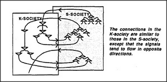

# Figure 8-10 — Paired K-society and S-society layers

**File:** `ch8/8-10.png`
**Appears in:** [../../som-8.11.md](../../som-8.11.md) — *Layers of societies*

## What the image shows

Two overlapping rectangular planes drawn one behind the other. The
back plane is labelled **S-SOCIETY** and contains a scattering of
small agent symbols; the front plane is labelled **K-SOCIETY** and
contains its own scattering, with curved lines weaving between the
two layers. A caption to the side reads, *The connections in the
K-society are similar to those in the S-society, except that the
signals tend to flow in opposite directions.*

## What it illustrates

The architectural arrangement that lets a K-society stay useful as
it grows. By laying the new layer of K-agents alongside its parent
S-layer, every K-line is at most one short hop from the original
S-agents it eventually controls. The figure foreshadows the
recursive picture of mental development as an open-ended stack of
such layer-pairs.
