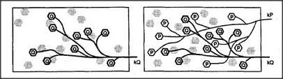

# Figure 8-2 — Two K-lines firing into the same field

**File:** `ch8/8-2.png`
**Appears in:** [../../som-8.2.md](../../som-8.2.md) — *Re-membering*

## What the image shows

Two panels. The left shows the field of agents with a K-line **kQ**
already attached to the cluster currently active for problem Q. The
right shows the same field with a second K-line **kP** also fanning
in from above, its lines threading among the Q-agents to touch the
older P-agents. The two activation patterns now overlap inside one
society.

## What it illustrates

What happens when an old memory is reawakened in the middle of a
new task. Today's problem has already aroused the Q-agents; some
recognition fires kP and the P-agents light up alongside them. The
diagram sets up the next figure's question — what to do when the
two patterns disagree.
