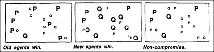

# Figure 8-3 — Three policies for handling K-line conflict

**File:** `ch8/8-3.png`
**Appears in:** [../../som-8.2.md](../../som-8.2.md) — *Re-membering*

## What the image shows

Three small panels in a row, each captioned. The left panel,
**Old agents win**, shows mostly P-agents lit with only stray
Q-agents around them. The middle panel, **New agents win**, shows
mostly Q-agents lit with only stray P-agents. The right panel,
**Non-compromise**, shows a sparse mix in which most of the
contested cells have gone quiet, leaving only the agents on which
the two patterns happened to agree.

## What it illustrates

The three obvious settlement schemes when remembered agents and
present agents collide for the same slot: yield to the memory, hold
on to the present, or let mutual veto silence both. The figure
exposes the trade-off — remembering vigorously risks overwriting
the work in progress; suppressing both loses information either way.
