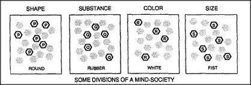

# Figure 8-4 — Partial states across mental divisions

**File:** `ch8/8-4.png`
**Appears in:** [../../som-8.4.md](../../som-8.4.md) — *Partial mental states*

## What the image shows

Four small panels in a row, each labelled with a mental division —
**SHAPE**, **SUBSTANCE**, **COLOR**, **SIZE** — and each containing
a scatter of agents in which a small subset is darkened to mark the
currently active ones. Beneath each panel, a word names the active
content: *ROUND*, *RUBBER*, *WHITE*, *FIST*. A banner across the
bottom reads **Some divisions of a mind-society**.

## What it illustrates

What it means for the mind to be in many *partial* states at once.
Thinking of a small white rubber ball is not a single state but four
simultaneous partial states, one in each relevant division. The
figure motivates the chapter's central distinction between the
single total state and the many partial states a society always
holds together.
