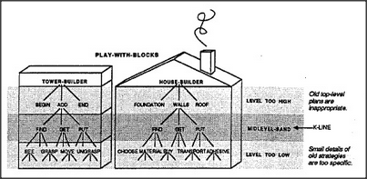

# Figure 8-6 — Reusing Tower Builder for House Builder

**File:** `ch8/8-6.png`
**Appears in:** [../../som-8.6.md](../../som-8.6.md) — *Levels*

## What the image shows

A single scene under the heading **Play-with-Blocks**. On the left
stands a labelled stack of agents headed **TOWER BUILDER**
(**BEGIN**, **ADD**, **END** above, **SEE**, **GRASP**, **MOVE**,
**UNGRASP** below). On the right stands a parallel structure headed
**HOUSE BUILDER** (**FOUNDATION**, **WALLS**, **ROOF** above,
**CHOOSE MATERIAL**, **SIZE**, **TRANSPORTATION SCHEME** below). A
shaded horizontal band labelled **MIDLEVEL-BAND** crosses both
stacks. Labels in the margin read *Level too high — old top-level
plans are inappropriate*, *K-line* (pointing at the band), and
*Level too low — small details of old strategies are too specific*.

## What it illustrates

Why the middle level-band of a learned society is what transfers
when an old skill is applied to a new task. Tower Builder's top
agents are too tower-specific to reuse for a house, and its lowest
agents are too gripper-specific for full-scale construction, but its
middle band — the patient business of choosing, placing, and
checking — applies almost intact.
