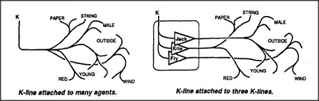

# Figure 8-7 — Two ways to wire a new memory

**File:** `ch8/8-7.png`
**Appears in:** [../../som-8.8.md](../../som-8.8.md) — *Societies of memories*

## What the image shows

Two panels under a common heading. The left, captioned **K-line
attached to many agents**, shows a single node **K** at the top with
a thick bundle of lines fanning out to roughly a dozen leaf agents
labelled with words such as **PAPER**, **STRING**, **MALE**,
**OUTSIDE**, **RED**, **YOUNG**, **WIND**. The right, captioned
**K-line attached to three K-lines**, shows the same leaves, but the
new **K** at the top now connects to only three intermediate boxes
labelled **JACK**, **FLY**, **KITE**, each of which in turn reaches
into the appropriate cluster of leaves.

## What it illustrates

The economy of building memories on top of other memories. Recording
*Jack flying his kite* by listing every aroused agent is wasteful;
recording it by linking three already-formed K-lines captures the
same scene with a handful of connections and inherits all the
structure those K-lines already encode.
