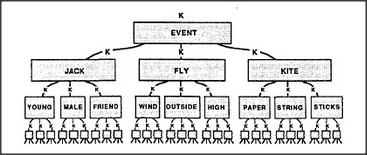

# Figure 8-8 — A K-line tree for "Jack flies a kite"

**File:** `ch8/8-8.png`
**Appears in:** [../../som-8.9.md](../../som-8.9.md) — *Knowledge-trees*

## What the image shows

A four-level inverted tree. At the apex, **K**; below it, **EVENT**;
below that, three children **JACK**, **FLY**, **KITE**. Each of
these has its own three children — **YOUNG**, **MALE**,
**FRIEND** under JACK; **WIND**, **OUTSIDE**, **HIGH** under FLY;
**PAPER**, **STRING**, **STICKS** under KITE — and each of those
fans out into a row of small generic agents at the bottom.

## What it illustrates

What an organised K-line memory looks like once the level-band rule
is applied. Instead of one flat fan to thousands of leaves, the
memory grows as a hierarchy in which each layer captures a
recognisable kind. The figure is the picture against which Minsky
sets the warning that real knowledge-trees will, in practice, get
tangled by shortcuts and exceptions.
